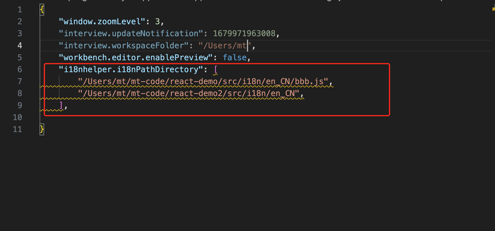
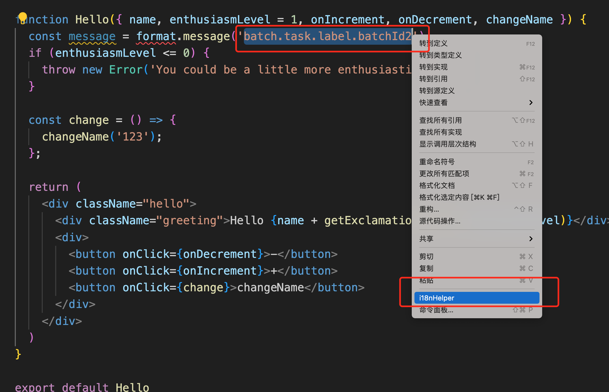
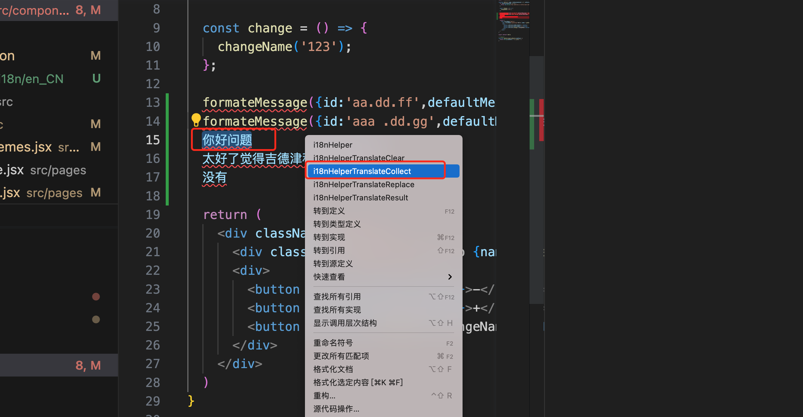
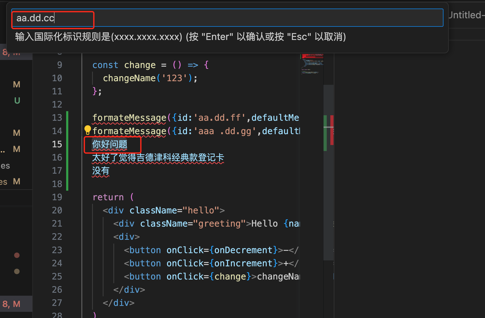
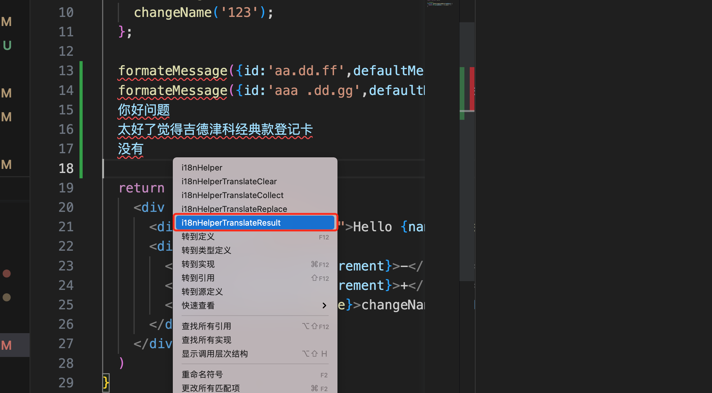
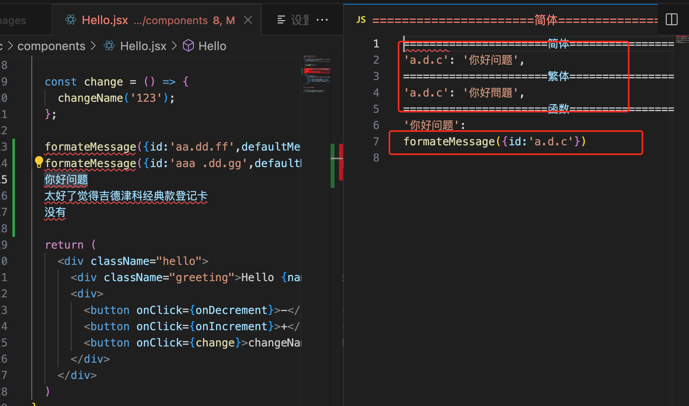
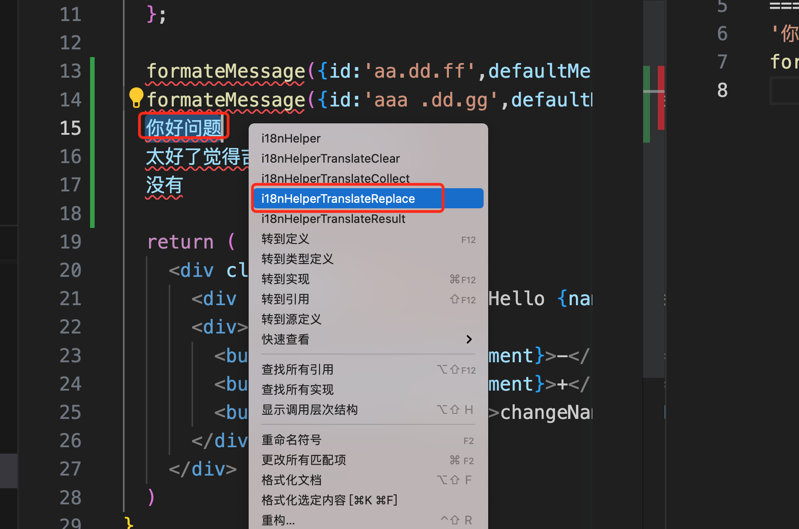
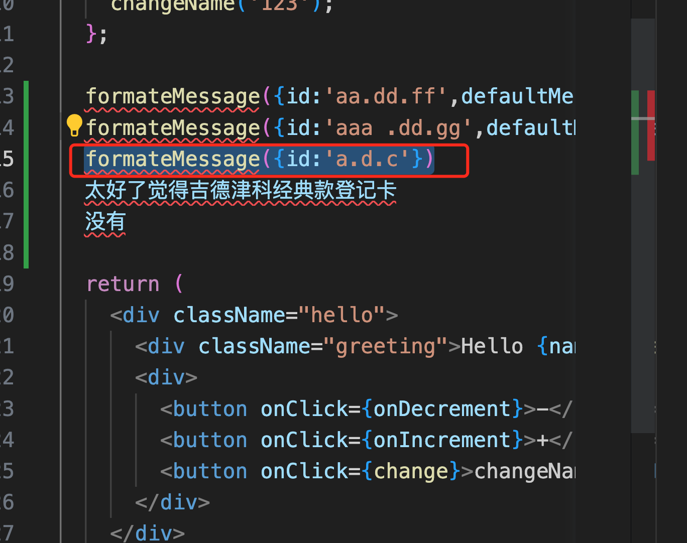
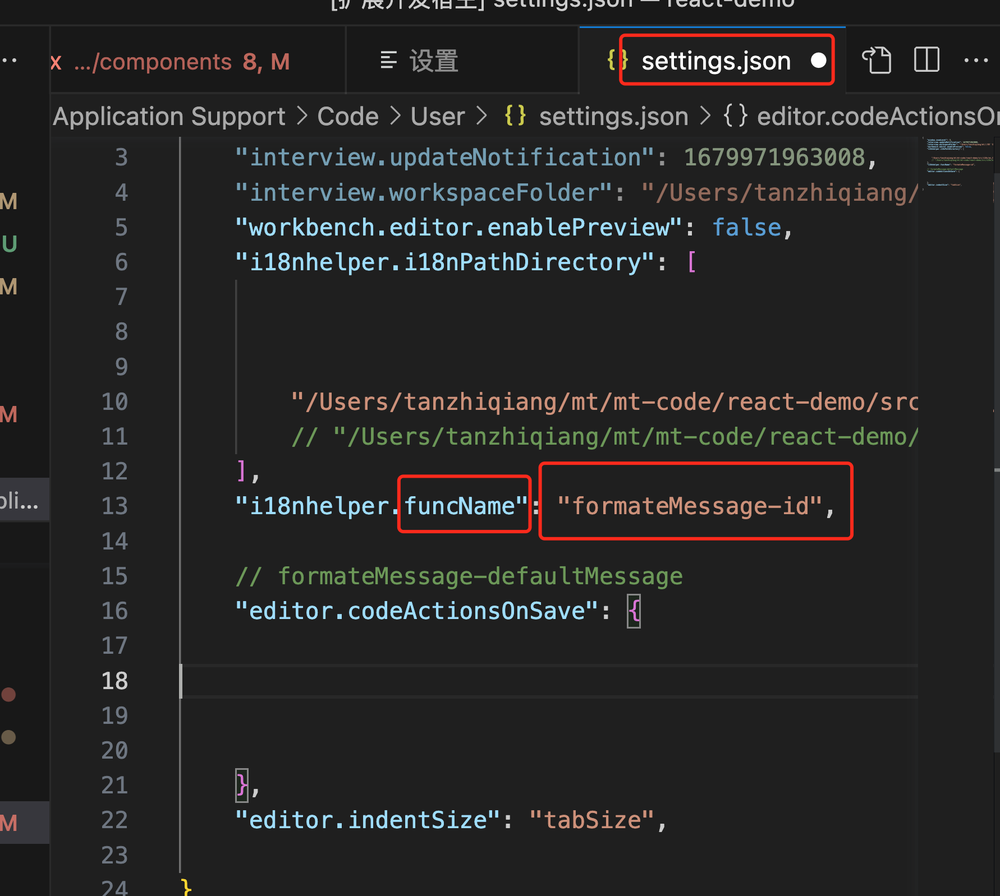

# i18nhelper README

## description

这是帮助国际化项目快速得到翻译内容的插件 
可以根据选中的'xx.xx.xx'或者最后一个名字xx，右键，得到翻译的文本的插件。

This is a plugin designed to assist internationalization projects. It allows you to quickly locate translated texts based on 'xx.xx.xx' notation or the last name 'xx'.
## development build

vsce package --no-yarn

## Features

一、选中词汇并翻译 
1.可同时设置多个项目的i18n配置 
2.可配置目录或者文件(目录会解析第一层的文件) 
二、国际化开发辅助工具 
1.根据中文含义批量生成国际化资源 
2.快速替换当前区域为正确的国际化文本 

一、translate the selected vocabulary 
1.You can simultaneously configure the i18n settings for multiple projects. 
2.You can configure directories or files (directories will parse the files in the first layer). 

二、国际化开发辅助工具 
1.根据中文含义批量生成国际化资源 
2.快速替换当前区域为正确的国际化文本 

## Requirements

vscode >= 1.48.0

## Extension Settings

在settings中搜索i18n 配置，然后在中配置i18nPathDirectory 数组  
exapmles: 
如果该项目是一个i18n的js文件，将这个文件的path放入到数组中 
如果是一个目录(eg:en_CN)就配置该目录path 
"i18nhelper.i18nPathDirectory": [ 
    "/Users/XXX/react-demo/src/i18n/en_CN/aaa.js", 
    "/Users/XXX/react-demo2/src/i18n/en_CN", 
], 
windows 注意: 
路径配置时需要加转义符号或者改为左斜杠(eg: "E:/xxxx/xxx") 

Search for i18n configuration in the settings, and then within it, configure an array called i18nPathDirectory. 
Examples: 
If the project involves an i18n JavaScript file, place the path of that file into the array.
If it's a directory (e.g., en_CN), configure the path for that directory. 
"i18nhelper.i18nPathDirectory": [ 
    "/Users/XXX/react-demo/src/i18n/en_CN/aaa.js", 
    "/Users/XXX/react-demo2/src/i18n/en_CN", 
], 
Windows Note:  
When configuring paths, you need to use escape characters or change the backslashes to forward slashes (e.g., "E:/xxxx/xxx").  

## Usage

选中'xx.xx.xx' 字符串或者最后一个xx字符串，然后右键选择i18nHelper ,就可以看到翻译后的文本

Select the 'xx.xx.xx' string or the last 'xx' string, then right-click and choose i18nHelper. This action will display the translated text for you.

一、选中词汇并翻译 

二、国际化开发辅助工具 

## contact

if you have some question ,please contact me.
573068185@qq.com

**Enjoy!**
